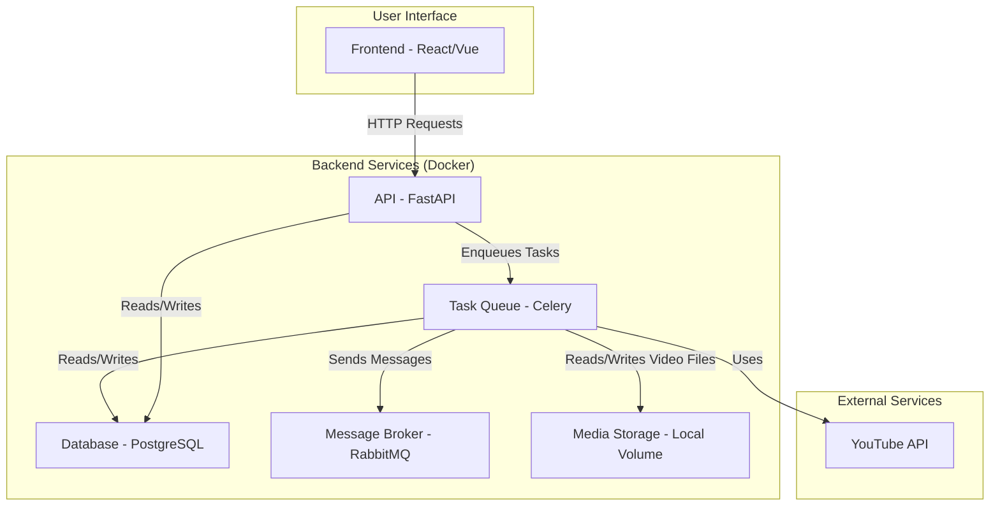

```mermaid
graph TD
    subgraph "User Interface"
        A[Frontend - React/Vue]
    end

    subgraph "Backend Services (Docker)"
        B[API - FastAPI]
        C[Task Queue - Celery]
        D[Database - PostgreSQL]
        E[Message Broker - RabbitMQ]
        F[Media Storage - Local Volume]
    end

    subgraph "External Services"
        G[YouTube API]
    end

    A -- "HTTP Requests" --> B
    B -- "Enqueues Tasks" --> C
    C -- "Reads/Writes" --> D
    C -- "Uses" --> G
    C -- "Reads/Writes Video Files" --> F
    B -- "Reads/Writes" --> D
    C -- "Sends Messages" --> E
```