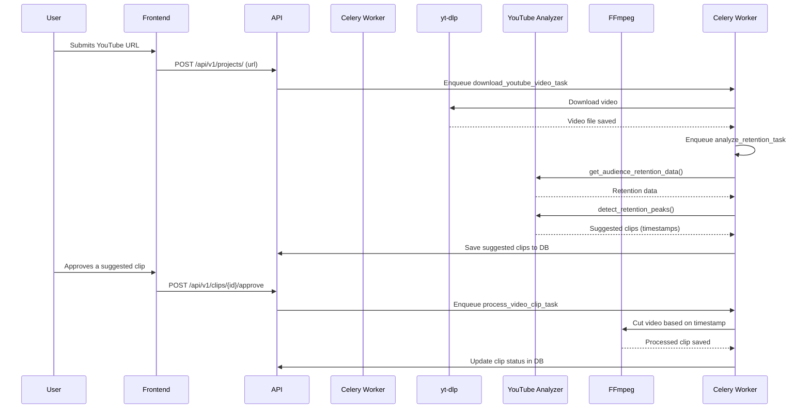

```mermaid
sequenceDiagram
    participant User
    participant Frontend
    participant API
    participant CeleryWorker as Celery Worker
    participant YouTubeDL as yt-dlp
    participant Analyzer as YouTube Analyzer
    participant FFmpeg

    User->>Frontend: Submits YouTube URL
    Frontend->>API: POST /api/v1/projects/ (url)
    API->>Celery Worker: Enqueue download_youtube_video_task

    Celery Worker->>YouTubeDL: Download video
    YouTubeDL-->>Celery Worker: Video file saved

    Celery Worker->>Celery Worker: Enqueue analyze_retention_task
    Celery Worker->>Analyzer: get_audience_retention_data()
    Analyzer-->>Celery Worker: Retention data
    Celery Worker->>Analyzer: detect_retention_peaks()
    Analyzer-->>Celery Worker: Suggested clips (timestamps)
    Celery Worker->>API: Save suggested clips to DB

    User->>Frontend: Approves a suggested clip
    Frontend->>API: POST /api/v1/clips/{id}/approve
    API->>Celery Worker: Enqueue process_video_clip_task

    Celery Worker->>FFmpeg: Cut video based on timestamp
    FFmpeg-->>Celery Worker: Processed clip saved
    Celery Worker->>API: Update clip status in DB
```